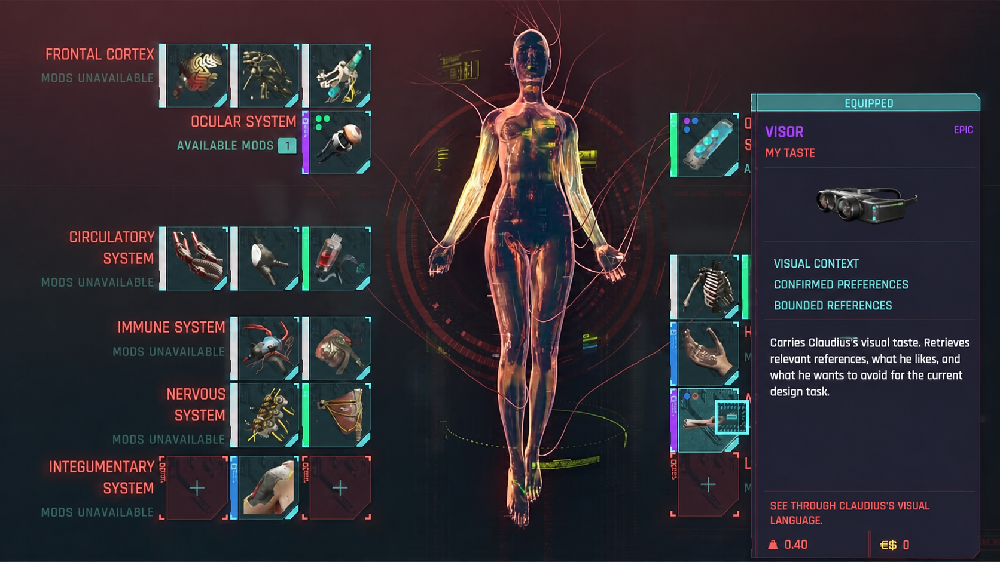

# Visor

Visor gives AI agents access to your visual context.

Drop images and videos into a private library. Visor indexes them, records the parts of them you like or want to avoid, and gives an agent only the references relevant to what it is creating. Your media stays local and is never committed to GitHub.



## 1. Install Visor

Visor requires Node.js 18 or newer.

```sh
git clone https://github.com/ClaudiusMa/visor.git
cd visor
npm link
```

This installs the `visor` command. To avoid installing it, replace `visor` below with `node bin/visor.mjs` and run commands from the repository.

## 2. Add your visual references

The repository includes a private `library/` folder. Put your mood-board images and videos there:

```text
library/
  posters/
  interfaces/
  motion/
```

Everything inside `library/` is ignored by Git except its empty placeholder. Your references will not be uploaded.

Initialize Visor and index the folder:

```sh
visor init
visor update
```

Run `visor update` again whenever you add or remove references.

## 3. Give an AI agent visual context

Ask Visor for references relevant to the current task:

```sh
visor context "editorial poster with expressive typography" --format markdown
```

Or add this instruction to any agent workspace:

```text
Before visual design work, run `visor context "<current task>" --format markdown`.
Inspect only the returned references. Use confirmed preferences as direction,
cite the reference IDs you used, and never modify or scan the complete library.
```

Visor returns a bounded context packet with media paths, previews, neutral visual observations, and confirmed taste signals.

## 4. Teach Visor your taste

Saving a reference does not mean you like everything about it. Review a small sample:

```sh
visor review --count 6 --format markdown
```

Ask your agent to show you those references and ask what you like, what you want to avoid, and where each reference is useful. After you confirm, it should create a file matching [`examples/feedback.json`](examples/feedback.json) and run:

```sh
visor feedback import <feedback.json> --confirmed
```

For optional visual analysis and profile-building workflows, see [`docs/contracts.md`](docs/contracts.md).

## 5. Use an existing library instead

You can point Visor at another folder:

```sh
visor init --folder "/absolute/path/to/my-mood-board"
```

Eagle is also supported as an optional example source:

```sh
visor init --eagle "/absolute/path/to/My Library.library"
```

Visor treats external sources as read-only.

## 6. Connect Visor to Engram

Connect Visor to [Engram](https://github.com/ClaudiusMa/engram), the personal knowledge system built to work with Visor. Keep them as separate repositories, install the Visor CLI, then add this instruction to Engram's agent instructions:

```text
When a task needs visual direction, run `visor context "<current task>" --format markdown`.
Use only the returned Visor packet. Treat confirmed feedback as taste and observations as description. Do not scan or modify the complete Visor library.
```

Engram supplies the agent's knowledge context. Visor supplies its visual context. The agent combines them only for the current task.

## Privacy

The visual library, local configuration, catalog, analysis, feedback, taste profile, generated previews, and review history are ignored by Git. Run `visor --help` for every available command.

Visor is licensed under the MIT License.
